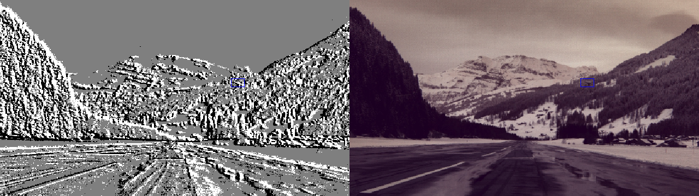

# Multimodal and Sparse Recurrent Transformers for Real-Time Object Detection

**Master's thesis · Sebastian Heusinger · MSc Robotics, Systems and Control, ETH Zürich · Center for Project-Based Learning (PBL), D-ITET · 2025**

[](docs/MasterThesis_Heusinger_2025.pdf)
[](setup_env.sh)
[](setup_env.sh)
[](LICENSE)

Real-time detection of small, fast drones from an **event camera** and an **RGB camera**, under the constraint
that the network has to run on an embedded GPU (NVIDIA Jetson). The thesis investigates two strategies:

1. **Filtering**: using the sparsity masks of a Scene Adaptive Sparse Transformer (SAST) to prune the tokens of a
   lightweight DETR (LW-DETR), so that the transformer only processes informative parts of the event stream.
2. **Multimodal fusion**: SAST+RGB, a detector that fuses SAST event features with YOLOX RGB features at the
   PAFPN stage and decodes them with a single YOLOX head.

The code builds on the official [SAST](https://github.com/Peterande/SAST) implementation (CVPR 2024) and adds the
multimodal detector, the LW-DETR variants, dataset converters and ONNX / TensorRT export.
The full thesis is in [`docs/MasterThesis_Heusinger_2025.pdf`](docs/MasterThesis_Heusinger_2025.pdf).

<p align="center">
  
  <br>
  <em>SAST+RGB: the SAST (events) and CSPDarknet (RGB) feature pyramids are summed and decoded by a YOLOX head.</em>
</p>

## TL;DR

- **Fusion wins.** SAST+RGB is the most accurate model on every dataset: **50.1 mAP / 48.6 AP<sub>small</sub>**
  on F-UAV-D, versus 44.4 / 44.0 for RGB-only YOLOX and 40.7 / 39.5 for event-only SAST (Table 5.2).
- **Still real-time on the edge.** The fused model has 31.3 M parameters and runs in **5.26 ms** per frame on a
  Jetson AGX Orin with TensorRT (Table 5.5).
- **Beats the NeRDD baseline with half the parameters.** 42.2 mAP vs 39.3 mAP for the NeRDD paper's best model,
  31.3 M vs 59.2 M parameters (Table 6.2).
- **Filtering has diminishing returns.** SAST-driven token pruning gives LW-DETR +5.7 AP<sub>small</sub> over
  SparseDETR, but costs ~3 ms; at 640 × 384 px input, shrinking the resolution beats filtering (Chapter 6).

## Results

All models are trained for 20 epochs with an 80/20 train/eval split; AP<sub>small</sub> and mAP are COCO metrics.
F-UAV-D is the drone dataset recorded at PBL; it was later published under the name
[SkyEV](https://arxiv.org/abs/2607.18747) (see [Related publication](#related-publication)).

### Detection accuracy on F-UAV-D (thesis Table 5.2)

| Model                    | Pretrained weights  | `model=`   | AP<sub>small</sub> | mAP      |
|--------------------------|---------------------|------------|-------------------:|---------:|
| YOLOX-RGB                | YOLOX-Tiny          | `rgb`      | 44.0               | 44.4     |
| YOLOX-Event              | YOLOX-Tiny          | `rgb`      | 38.8               | 40.5     |
| LWDETR-RGB               | –                   | `lwdetr`   | 13.9               | 13.3     |
| LWDETR-Event             | –                   | `lwdetr`   | 28.2               | 30.6     |
| SparseDETR\*             | LWDETR-Tiny         | –          | 20.4               | 32.5     |
| SAST                     | 1 Mpx               | `rnndet`   | 39.5               | 40.7     |
| **SAST+RGB**             | 1 Mpx + YOLOX-Tiny  | `eventrgb` | **48.6**           | **50.1** |
| SAST+LWDETR              | 1 Mpx               | `lwdetr`   | 26.1               | 28.5     |
| SAST-Pretrained+LWDETR   | F-UAV-D             | `lwdetr`   | 26.7               | 28.6     |

\* previous filtering work, values reported from its paper.

### Inference (thesis Table 5.5)

Single frame of 640 × 384 px, batch size 1. RTX 4090: unoptimized PyTorch. Jetson AGX Orin: ONNX → TensorRT engine.

| Model         | Params [M] | GFLOPs | RTX 4090 [ms] | AGX Orin [ms] |
|---------------|-----------:|-------:|--------------:|--------------:|
| YOLOX-RGB     | 9.0        | 16.2   | 2.61          | 1.92          |
| YOLOX-Event   | 9.0        | 18.6   | –             | 3.64          |
| LWDETR-RGB    | 7.5        | 8.0    | 3.65          | 1.63          |
| LWDETR-Event  | 8.3        | 9.6    | 3.89          | 2.76          |
| SparseDETR\*  | 11.9       | 7.4    | 4.5 – 7.0     | 1.9 – 4.3     |
| SAST          | 18.9       | 42.0   | 6.55          | 4.98          |
| **SAST+RGB**  | 31.3       | 52.3   | 7.92          | **5.26**      |
| SAST+LWDETR   | 30.7       | 43.9   | 9.72 – 10.18  | 5.09 – 6.24   |

### Comparison with the NeRDD baseline (thesis Table 6.2)

| Model                       | Params [M] | mAP      | AP<sub>IoU=.75</sub> |
|-----------------------------|-----------:|---------:|---------------------:|
| NeRDD Pooling (Encoder)     | 59.2       | 39.3     | 27.2                 |
| **SAST+RGB (ours)**         | **31.3**   | **42.2** | **42.2**             |

<details>
<summary>More tables: NeRDD and mixed-dataset training (thesis Tables 5.3 and 5.4)</summary>
<br>

**NeRDD** (Table 5.3)

| Model                    | AP<sub>small</sub> | mAP      |
|--------------------------|-------------------:|---------:|
| YOLOX-RGB                | 9.9                | 9.7      |
| YOLOX-Event              | 31.9               | 31.9     |
| LWDETR-RGB               | 0.0                | 0.0      |
| LWDETR-Event             | 32.6               | 32.9     |
| SAST                     | 35.7               | 36.0     |
| **SAST+RGB**             | **36.7**           | **37.3** |
| SAST+LWDETR              | 29.0               | 29.3     |
| SAST-Pretrained+LWDETR   | 28.6               | 28.9     |

**Mixed: 100 % of F-UAV-D + 20 % of NeRDD** (Table 5.4)

| Model                    | AP<sub>small</sub> | mAP      |
|--------------------------|-------------------:|---------:|
| YOLOX-RGB                | 33.8               | 34.5     |
| YOLOX-Event              | 35.2               | 36.5     |
| LWDETR-RGB               | 12.7               | 12.4     |
| LWDETR-Event             | 30.0               | 31.8     |
| SAST                     | 40.9               | 42.5     |
| **SAST+RGB**             | **43.7**           | **45.0** |
| SAST+LWDETR              | 26.5               | 28.1     |
| SAST-Pretrained+LWDETR   | 27.6               | 29.0     |

</details>

### Qualitative

<p align="center">
  
  <br>
  <em>SAST+RGB detections (RGB frame left, event histogram right) on a complex background with high event activity.
  RGB-only YOLOX produces false positives in the forest area of such scenes; the fused model does not.</em>
</p>

### Datasets

- **F-UAV-D / [SkyEV](https://arxiv.org/abs/2607.18747)** — synchronized RGB + event recordings of drones with
  camera ego-motion and very small targets, recorded at PBL. Called F-UAV-D in the thesis and in
  `preprocessing/armasuisse.py`; published as SkyEV (not publicly downloadable yet).
- **[NeRDD](https://github.com/MagriniGabriele/NeRDD)** — Neuromorphic RGB-Event Drone Detection dataset.

Both are converted to a common on-disk format by the scripts in [`preprocessing/`](preprocessing/README.md)
(event histograms, RGB frames and labels as paired `.npz` files per sequence).

## Architectures

| `model=`   | Description                                                                              | Input           |
|------------|------------------------------------------------------------------------------------------|-----------------|
| `rnndet`   | Base SAST: sparse recurrent transformer backbone + YOLOX FPN/head                        | events          |
| `rgb`      | Base YOLOX (CSPDarknet + PAFPN + head)                                                   | RGB (or events) |
| `eventrgb` | **SAST+RGB**: SAST branch + CSPDarknet branch, summed at the PAFPN, one YOLOX head       | RGB + events    |
| `lwdetr`   | LW-DETR whose ViT tokens are pruned with the sparsity masks predicted by SAST            | events          |

<p align="center">
  
  <br>
  <em>SAST+LW-DETR: SAST acts as a mask generator; its window/token selection sparsifies the LW-DETR transformer.</em>
</p>

## Getting started

### Installation

```bash
./setup_env.sh        # creates the conda env "sast" (Python 3.9, PyTorch 2.0, CUDA 11.8, Lightning, Hydra)
conda activate sast
```

Detectron2 is optional but speeds up the COCO-style evaluation.
The LW-DETR deformable-attention CUDA ops are built by the setup script (`models/detection/lwdetr/ops`).

### Pre-trained checkpoints

| YOLOX | SAST | LW-DETR |
|-------|------|---------|
| [YOLOX-s](https://github.com/Megvii-BaseDetection/YOLOX) | [1 Mpx](https://github.com/Peterande/SAST) | [LWDETR_tiny_30e_objects365](https://github.com/Atten4Vis/LW-DETR) |

Set the checkpoint paths in the corresponding `config/model/*.yaml`.

### Training

Configuration is handled by [Hydra](https://hydra.cc); every value below can be overridden on the command line.

```bash
# batch size, GPUs, learning rate and DATA_DIR
source set_envs.sh

# SAST+RGB on the preprocessed F-UAV-D / NeRDD data (dataset=eventrgb)
python train.py model=eventrgb dataset=eventrgb dataset.path="${DATA_DIR}" \
  +experiment/arma="base.yaml" \
  batch_size.train=${BATCH_SIZE_PER_GPU} batch_size.eval=${BATCH_SIZE_PER_GPU} \
  hardware.gpus=[${GPUS}] training.learning_rate=${lr} \
  wandb.project_name=FUAVD wandb.group_name=eventrgb

# RGB-only YOLOX baseline with a pretrained backbone
python train.py model=rgb dataset=eventrgb dataset.path="${DATA_DIR}" \
  +experiment/arma="base.yaml" fpn.ckpt=yolox_s.pth \
  batch_size.train=${BATCH_SIZE_PER_GPU} batch_size.eval=${BATCH_SIZE_PER_GPU} \
  hardware.gpus=[${GPUS}] training.learning_rate=${lr}
```

`+experiment/gen4=...` and `+experiment/gen1=...` select the Prophesee Gen4 / Gen1 settings inherited from SAST;
`+experiment/lwdetr=...` configures the LW-DETR variants. Training logs go to Weights & Biases.

### Evaluation

```bash
python validation.py model=eventrgb dataset=eventrgb dataset.path="${DATA_DIR}" \
  checkpoint=<path/to/ckpt> hardware.gpus=${GPUS} use_test_set=True   # single GPU only
```

### Deployment: ONNX and TensorRT

```bash
python export.py          # exports the model from config/detect_lwdetr.yaml to ONNX (onnxsim) and builds a TensorRT engine
python run_onnx.py        # latency benchmark of model.onnx with onnxruntime (CUDA execution provider)
```

The [`tensorrt`](https://github.com/Heusini/SAST/tree/tensorrt) branch contains the model changes needed for a
clean TensorRT conversion of SAST, plus benchmark scripts.

## Repository layout

```
config/          Hydra configs: dataset, model, experiment presets
data/            Dataset classes (event_rgb, genx), representations, augmentation
preprocessing/   Converters for F-UAV-D/SkyEV and NeRDD into the paired .npz format (+ README)
models/
  detection/
    event_rgb/   SAST+RGB fusion detector (SAST + CSPDarknet → YOLOX head)
    lwdetr/      LW-DETR with SAST-driven token sparsification
    rgb_yolo/    YOLOX RGB detector
    recurrent_backbone/  SAST recurrent backbone
  layers/SAST/   Scene Adaptive Sparse Transformer layers
modules/         PyTorch Lightning modules (one *_step.py per model type)
utils/, util/    Evaluation (Prophesee / COCO), optimizers, timers, helpers
docs/            Thesis PDF
train.py, validation.py, export.py, run_onnx.py
```

## Related publication

Parts of this work, the SAST+RGB fusion detector and the dataset tooling, were later used as the detection baseline
in the SkyEV dataset paper, where the drone recordings are published under the name SkyEV:

J. Mandula, S. Heusinger, J. Moosmann, C. Vogt, M. Magno.
*SkyEV: RGB-Event UAV Detection and Tracking Dataset and Baseline.* arXiv:2607.18747, 2026.
[[paper]](https://arxiv.org/abs/2607.18747)

## Citation

```bibtex
@mastersthesis{heusinger2025multimodal,
  author = {Sebastian Heusinger},
  title  = {Multimodal and Sparse Recurrent Transformers for Real-Time Object Detection},
  school = {ETH Z{\"u}rich, Center for Project-Based Learning, D-ITET},
  year   = {2025},
}
```

## Built on

This repository started as a modified copy of [SAST](https://github.com/Peterande/SAST)
(Peng et al., *Scene Adaptive Sparse Transformer for Event-based Object Detection*, CVPR 2024) and uses code from:

- [SAST](https://github.com/Peterande/SAST) — SAST architecture
- [RVT](https://github.com/uzh-rpg/RVT) — recurrent vision transformer implementation and data pipeline
- [timm](https://github.com/huggingface/pytorch-image-models) — original MaxViT layers
- [YOLOX](https://github.com/Megvii-BaseDetection/YOLOX) — CSPDarknet backbone, PAFPN and detection head
- [LW-DETR](https://github.com/Atten4Vis/LW-DETR) — lightweight DETR detector and export tooling

Licensed under the [MIT License](LICENSE).
